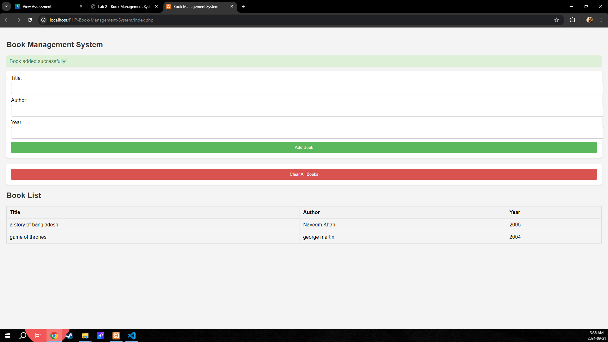
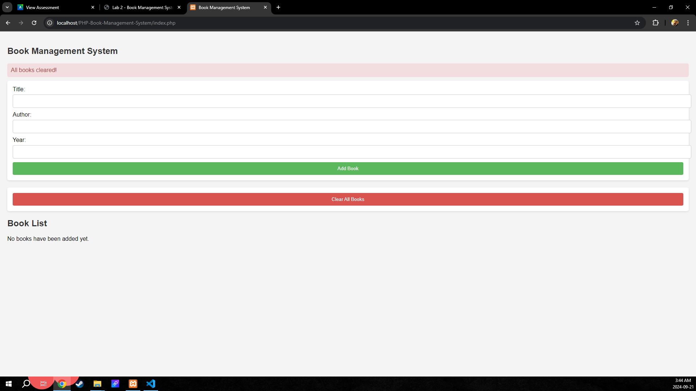
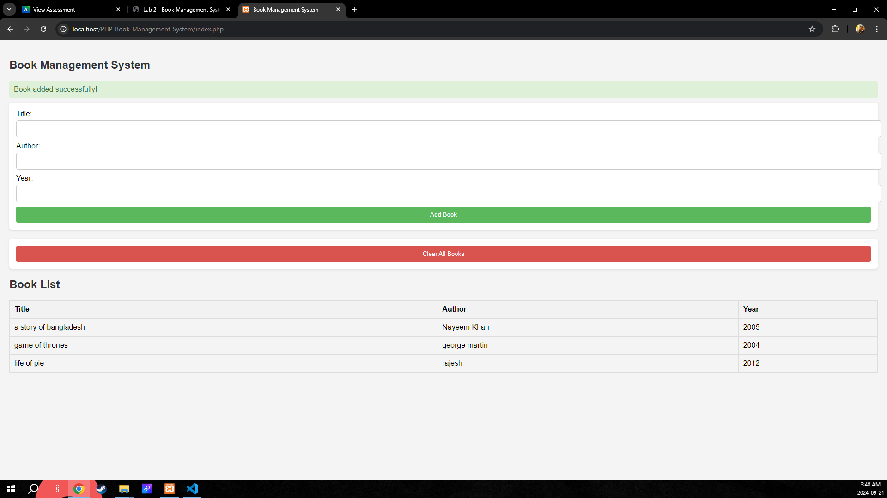
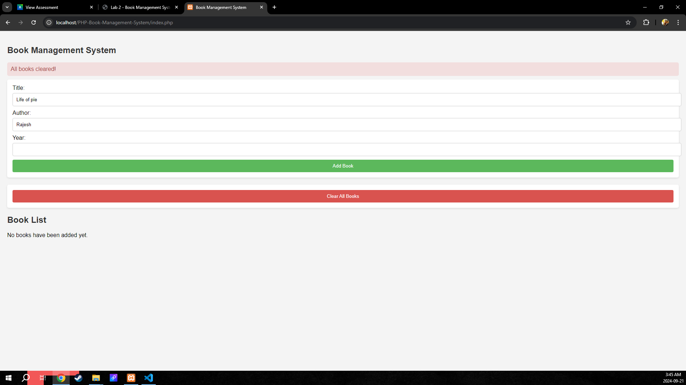
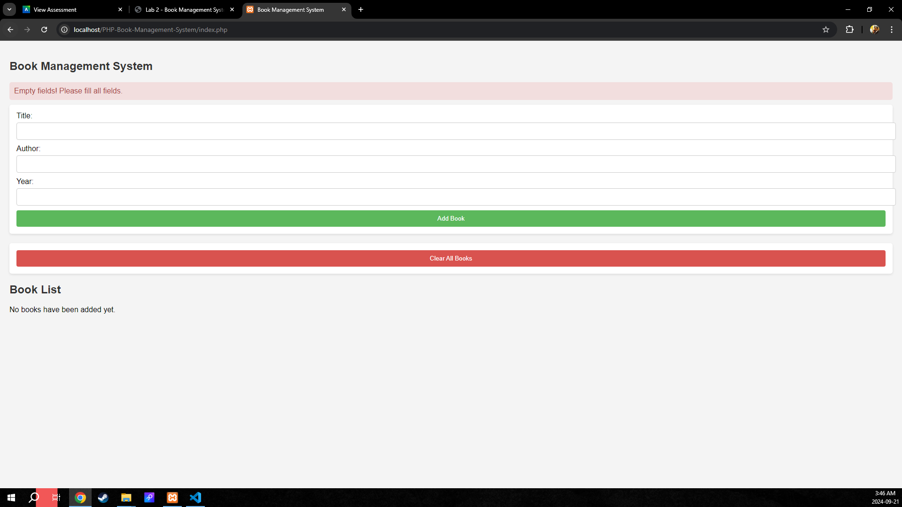

# Book Management System
# Name: Abdun Nayeem Khan
# NID: N01608790
## Overview
This project is a simple Book Management System that allows users to add books, view a list of added books, and clear the list.

## Features
- Add new books with title, author, and publication year.
- Display a list of all added books.
- Clear all books from the list.
- Error handling for invalid input.

## Requirements
- A web server with PHP support (e.g., XAMPP, WAMP, or a live server).
- PHP version 7.0 or higher.

## How to Run
1. Clone or download this repository to your local machine.
2. Place the project folder in the web server's root directory (e.g., `htdocs` for XAMPP).
3. Open your web browser and navigate to `http://localhost/PHP-Book-Management-System/`.
4. Use the form to add books, view the list, or clear all books.

## PHP Features Explanation
This project utilizes several key PHP features:

### 1. Session Management
- **`session_start()`**: Starts a new session or resumes an existing one, allowing you to store user-specific data across requests.
- **`$_SESSION`**: A superglobal array used to store session variables.

### 2. Form Handling
- **`$_SERVER["REQUEST_METHOD"]`**: Checks the request method (e.g., POST).
- **`$_POST`**: Captures data sent via the POST method for access to form input values.

### 3. Control Structures
- **`if` statements**: Validate that all fields are filled before processing data.
- **`isset()`**: Useful for determining if the "clear" button was clicked.

### 4. Object-Oriented Programming (OOP)
- **Class Definition**: Defines a `Book` class with attributes and methods to manage book data.
- **Instantiation**: Creates new instances of the `Book` class based on user input.

### 5. Error Handling
- **Try-Catch Blocks**: Handles exceptions when creating `Book` instances.

### 6. Data Validation and Sanitization
- **`htmlspecialchars()`**: Prevents XSS attacks by converting special characters to HTML entities.

## Screenshots

Below are some screenshots of the application:

*Books get added to the list instantly*

*We can clear the books which resets the session and empties the array *

*We can see all the books right away after adding.*

*When we click add books we get the below screenshot*

*Incomplete field not accepted*
